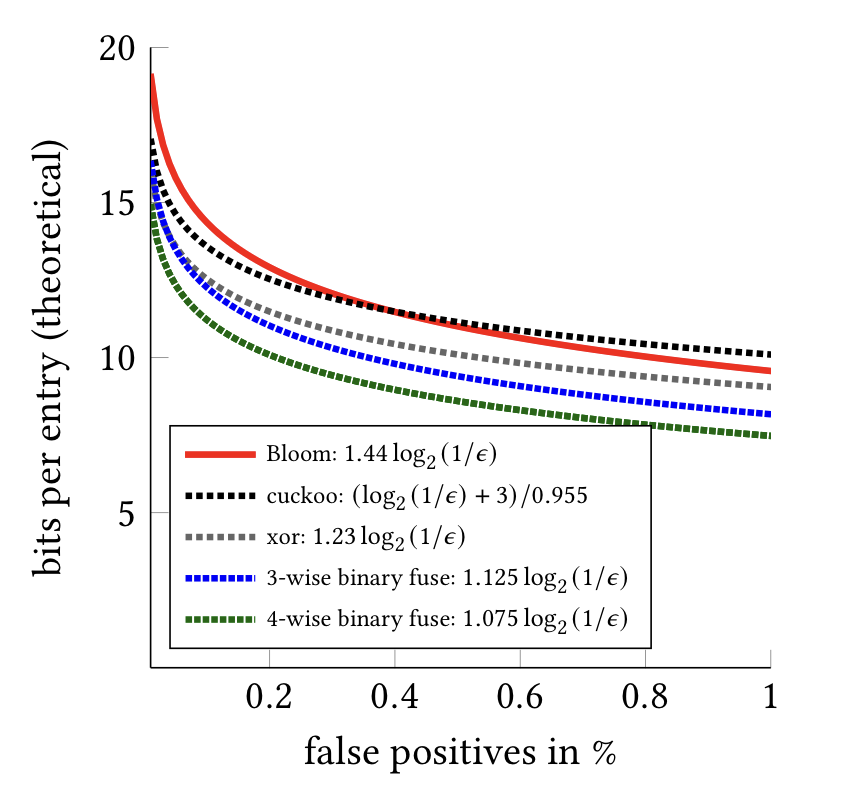

# xorfilter: Go library implementing xor and binary fuse filters
[](https://godoc.org/github.com/FastFilter/xorfilter)
[](https://cloud.drone.io/FastFilter/xorfilter)

Bloom filters are used to quickly check whether an element is part of a set.
Xor and binary fuse filters are a faster and more concise alternative to Bloom filters.
They are also smaller than cuckoo filters.

* Thomas Mueller Graf, Daniel Lemire, [Binary Fuse Filters: Fast and Smaller Than Xor Filters](http://arxiv.org/abs/2201.01174), Journal of Experimental Algorithmics (to appear). DOI: 10.1145/3510449   
* Thomas Mueller Graf,  Daniel Lemire, [Xor Filters: Faster and Smaller Than Bloom and Cuckoo Filters](https://arxiv.org/abs/1912.08258), Journal of Experimental Algorithmics 25 (1), 2020. DOI: 10.1145/3376122




We are assuming that your set is made of 64-bit integers. If you have strings
or other data structures, you need to hash them first to a 64-bit integer. It
is not important to have a good hash function, but collision should be unlikely
(~1/2^64).

The current implementation has a false positive rate of about 0.3% and a memory usage
of less than 9 bits per entry for sizeable sets.

You construct the filter as follows starting from a slice of 64-bit integers:

```Go
filter,_ := xorfilter.PopulateBinaryFuse8(keys) // keys is of type []uint64
```
It returns an object of type `BinaryFuse8`. The 64-bit integers would typically be hash values of your objects.

You can then query it as follows:


```Go
filter.Contains(v) // v is of type uint64
```

It will *always* return true if v was part of the initial construction (`Populate`) and almost always
return false otherwise.

An xor filter is immutable, it is concurrent. The expectation is that you build it once and use it many times.

Though the filter itself does not use much memory, the construction of the filter needs many bytes of memory per set entry.

For persistence, you only need to serialize the following data structure:

```Go
type BinaryFuse8 struct {
	Seed               uint64
	SegmentLength      uint32
	SegmentLengthMask  uint32
	SegmentCount       uint32
	SegmentCountLength uint32

	Fingerprints []uint8
}
```

# Duplicate keys

 When constructing the filter, you should ensure that there are not too many  duplicate keys. If you are hashing objects with a good hash function, you
 should have no concern, because there should be very few collisions. However,
 you can construct cases where there are many duplicates. If you think that this might happen, then you should check the error condition.

 ```Go
 filter,err := xorfilter.PopulateBinaryFuse8(keys) // keys is of type []uint64
 if err != nil {
  // you have too many duplicate keys, de-duplicate them?
 }
 ```

 Effectively, an error is returned when the filter could not be build after `MaxIterations` iterations (default to 100).

# Implementations of xor filters in other programming languages

* [Erlang](https://github.com/mpope9/exor_filter)
* Rust: [1](https://github.com/bnclabs/xorfilter), [2](https://github.com/codri/xorfilter-rs), [3](https://github.com/Polochon-street/rustxorfilter), [4](https://github.com/ayazhafiz/xorf)
* [C++](https://github.com/FastFilter/fastfilter_cpp)
* [Java](https://github.com/FastFilter/fastfilter_java)
* [C](https://github.com/FastFilter/xor_singleheader)
* [C99](https://github.com/skeeto/xf8)
* [Python](https://github.com/GreyDireWolf/pyxorfilter)
* [C#](https://github.com/MichaelStromberg-Illumina/SaOptimization/blob/16d40594eeebc6593ddf6ff42bb79eb06a8099a0/NirvanaCommon/Xor8.cs)
